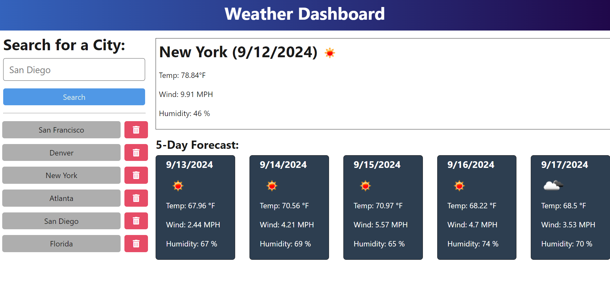

# Weather Dashboard
  

## Description

People nowadays travel all over the world, and they tend to look up the weather for multiple cities, and for the days to come as well to plan for their trips accordingly. For that, this is an application that they could use wherever they are and wherever they plan to be.

## Table Of Contents

  - [Installation](#installation)
  - [Usage](#usage)
  - [License](#license)
  - [Contributing](#contributing)
  - [Tests](#tests)
  - [Questions](#questions)

## Installation

- Clone the repository to your local machine.
- Install node.js.
-   Navigate to the directory of the Weather Dashboard and run on the terminal: **npm i**. This should install all of the dependencies on both the client and server side. 

## Usage

once the installation process is complete, open your terminal, and run: **npm run start:dev** This should run through some commands, and eventually load up the page. 

you will be presented WITH a page asking  you to Search by City. in the box where it says "Search by City", type in your desired City and press Search. This should then populate the current weather of the city, the date, the  temperature, wind speed and the humidity. below that there would be a list of a forecast list for the next 5 days. It should be similar to the below screenshot. 

## License

This project is licensed under the MIT License. To learn more about this means, click the license button at the top.
  
## Tests

N/A

## Questions

GitHub Profile: https://github.com/Souad-hb

If you have any additional questions, feel free to contact me at: souadsalahh@gmail.com 
